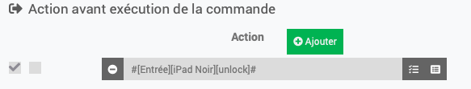

Commandes perso
==================

Le plugin contient 2 commandes par défaut lors de la création d'un équipement.
Il est possible d'en créer davantage en cliquant sur le bouton "Ajouter une commande perso".


La commande perso permet de personnaliser soi-même une information/action en entrant la commande bash/ssh.

**INFORMATION : à partir des scripts existants**
---------------------

Le script current_page.sh :
- donne le nom de la page actuelle ouverte sur l'équipement (springboard/lockscreen/application) dans le cas d'application, le vrai nom de l'éapplication est recherché et affiché.
- commande à saisir dans le champ : *bash jailed/current_page.sh*
- arguments de la commande (ajouter en fin de ligne...) : aucun
- argument optionnel de la commande : *-i* en fin de commande pour rechercher sur iTunes le nom de l'app.

Exemples de commandes et la valeur de la commande sur Jeedom :
```bash jailed/current_page.sh``` : ```lockscreen``` (l'écran est verrouillé)
```bash jailed/current_page.sh``` : ```springboard``` (il s'agit de l'écran d'accueil)
```bash jailed/current_page.sh``` : ```Books``` (il s'agit de l'application Livres)
```bash jailed/current_page.sh -i``` : ```Livres``` (il s'agit de l'application Livres)

> **Note**  
> Pour fonctionner, il faut installer le tweak Activator.

Les commandes ssh :
Si vous connaissez une commande permettant d'obtenir une information utile, n'hésitez pas à me le remonter.

Exemple de commandes et la valeur de la commande sur Jeedom :

| Commande               |            Résultat    |   Commentaire|
| ---------------------- |: -------------: | ---------: |
| batterydata \| grep "BatteryHealth :" \| cut -d: -f2 \| sed -e 's/\ //'``` : ```Good``` (affiche l'état de la batterie)
| batterydata \| grep "InstantAmperage :" \| cut -d: -f2 | sed -e 's/\ //'``` : ```-82``` (affiche la consommation actuelle de l'appareil en mA)
| batterydata \| grep "Watts =" \| cut -d= -f2 | sed -e 's/\ //' | sed -e 's/;//'  | head -n1``` : ```-82``` (affiche la puissance de l'adaptateur en Watt)
| batterydata | grep "TimeRemaining :" | cut -d: -f2 | sed -e 's/\ //'``` : ```0``` (affiche le temps restant avant charge complete en s)
| lightsensor | grep DayLight | cut -d= -f2 | sed -e s/\ //g``` : ```1``` (1 = lumière directe reçue)
| sensors |  grep "Thermal sensors" | cut -d':' -f2 | sed -e s/\(//g | sed -e s/\)//g``` : ```30 thermal sensors found``` (nombre de sondes de température disponibles)
| sensors | sed -n '/Thermal sensors/,$p'``` : ```=> Thermal sensors (°C): (30 thermal sensors found)\n-------------------------\nnear WiFi (top side) = 20.363647;
...
Avg: PMGR SOC Die Temp Sensor0 = 21.890625;``` (affiche toutes les sondes de température disponibles et leur valeur en °C)
```sensors |  grep "Avg: PMGR SOC Die Temp Sensor0" | cut -d'=' -f2 | sed -e s/\ //g | | sed -e 's/;//g'``` : ```21.890625``` (affiche la valeur en °C donnée par une sonde de température)

**ACTION : à partir des scripts existants**
-----------------------
Le script activator_send.sh :
- commande à saisir dans le champ : *bash jailed/activator_send.sh XXX*
- arguments de la commande (remplacer XXX par...) : un des paramètres listés ici (https://flobul.github.io/Jailbreak/fr_FR/#tocAnchor-1-13-1) => *low-power/home/respring/sleep/location/rotation/avion/verrou/modesombre/moinsfort/plusfort/audio 100/lumiere 100/screenshot/photo/pluslumiere/moinslumiere*
- argument optionnel de la commande :  un chiffre de de 1 à 10 (répétition de la commande)


Les commandes manuelles :
- Activator : *activator send <listeners>*
avec <listeners> : une des lignes listées dans le champ texte de Menu Installation > Equipement > Activator Listeners
permet d'ouvrir toutes les applications disponibles sur l\'équipement et d'éxecuter des 


Utiliser votre appareil comme caméra de surveillance (*Activator*/*SimulateTouch*)
----------------------------------------------------------------------------------
Utilisez votre appareil comme caméra de surveillance.  
Nécessite une Application de l'App Store (Periscope HD ou XXX).  
Nécessite un lecteur de flux RTSP (Synology, VLC...)  
	(Periscode HD) - Filme dès l'ouverture de l'application.  
	(IP Camera Lite) - Une fois l'app ouverte, cliquer sur "Turn on IP Camera Server" pour filmer. ```stouch touch 10 500```

Raccourcis (iOS12/13)
---------------------
1) Sur l'application **Raccourcis**, récupérer le nom du raccourci créé/téléchargé.  
2) Sur Jeedom, dans la commande perso, entrer ```uiopen "shortcuts://run-shortcut?name=XXX"``` en remplaçant XXX par le nom du raccourci.  
*[Si votre appareil est verrouillé, pensez à lancer la commande de déverrouillage avant celle-ci, commande unlock](https://flobul.github.io/Jailbreak/fr_FR/#tocAnchor-1-13-10)*  

Text To Speech (iOS 9/10/11/12/13)
-------------------------
Faites parler Thomas, Amelie ou Siri en envoyant le message désiré.
Depuis le dashboard, saisissez le texte que vous souhaitez faire lire à votre appareil (limite de 5 secondes de lecture)
Depuis Jeedom (scenario, script, autre plugin...), vous pouvez utiliser l'action message pour faire parler votre appareil.

SMS (9/10/11/12/13)
-------------------
Envoyez un SMS depuis votre appareil via Jeedom.
Prérequis : avoir un iPhone (iPad, AppleWatch non fonctionnels), avoir une carte SIM active sur l'iPhone.

GPS (9/10/11/12/13)
-------------------
Récupérer les coordonnées GPS de l'appareil grâce à l'outil gpsloc.
Autorisez la localisation pour l'App Localiser mon iPhone sur votre appareil. 

ASTUCE pour executer la commande déverrouillage avant une commande
------------------------------------------------------------------
Dans les réglages de la commande que l'on veut lancer (ouvrir Safari, ouvrir une app), ajoutez une *action avant d'execution la commande*, et cherchez la commande de deverrouillage (unlock) puis sauvegardez.




Liste des versions
==================

*[Voir la liste des versions](changelog.md)*
