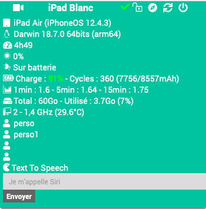
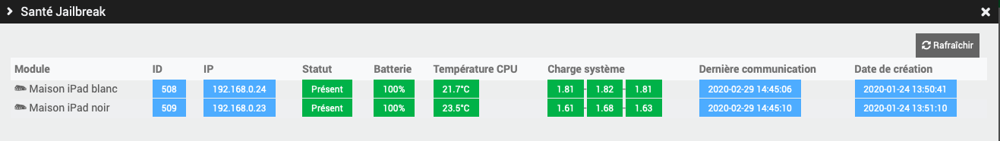
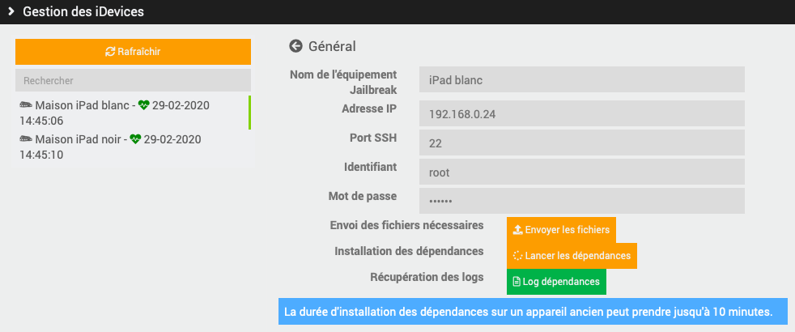
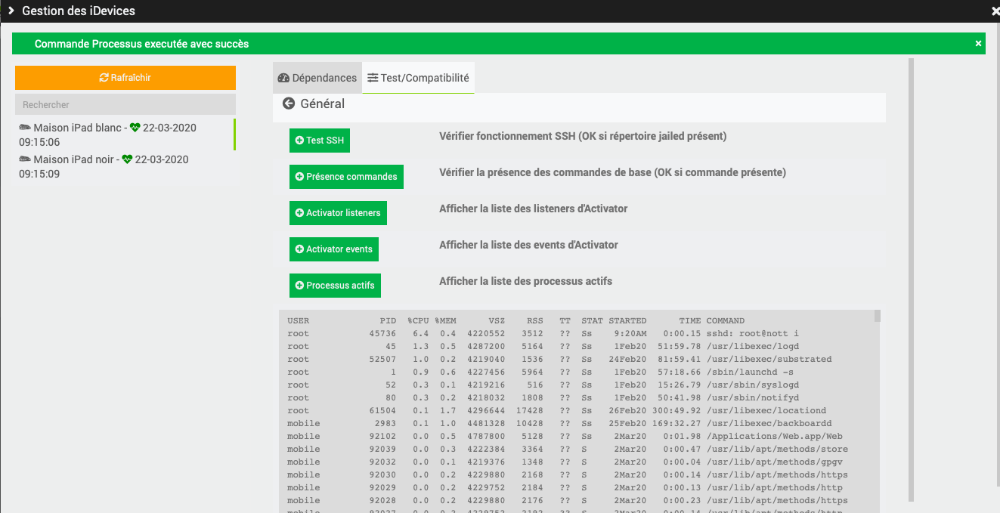
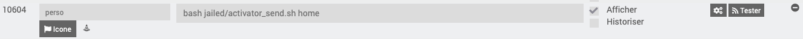
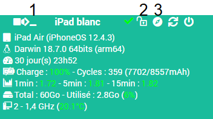
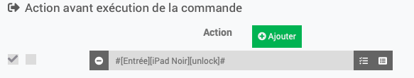

Présentation Jailbreak
==================


Ce plugin permet de récupérer les informations et commander les équipements Apple jailbreakés.

> **Note**  
> Pour fonctionner, il faut installer le tweak OpenSSH sur l'appareil.

**Fonctionnalités**
---------------------
- Éteindre / redémarrer,
- affichage les informations de l'appareil, (*Modèle, version, système d'exploitation, uptime, état batterie, charge système, espace total/utilisé, processeur et température, luminosité...*)
- déverrouiller l'appareil,
- envoyer des notifications ou des bulletins,
- lancer des applications à distance,
- lancer des raccourcis à distance,
- filmer et envoyer le flux caméra en RTSP,
- tester les tweaks, voir les processus actifs,
- faites parler votre appareils via Siri (listez les voix disponbiles, plusieurs langues disponibles).

**Modèles compatibles**
-----------------------
- iPad / iPhone (non testé sur AppleTV/iWatch...)

Dashboard
=========



Configuration du plugin
=======================

Après téléchargement du plugin, activer le plugin.

Configuration des équipements
=============================

Afin d'intéragir entièrement avec le plugin Jailbreak, les équipements ont besoin que certains paquets/outils définis soient installés.
Voici la liste de ces paquets :
- apt : *gestionnaire de paquet qui permet d'installer tout le reste*
- curl, wget : *permet de télécharger des ressources*
- adv-cmds, coreutils, gawk, grep, sed : *utile pour trier/selectionner des résultats*
- git : *inutilisé pour l'instant, mais peut être utilisé pour mettre à jour des commandes*
- system-cmds, top, uikittools : *commandes système de l'état de l'appareil*
- unrar, unzip : **
- sshlock : *pour verrouiller l'équipement*
- open : *pour ouvrir une app/page*
- activator, activatorfix : *permet d'ouvrir/lancer/afficher des pages/app/evenement*
- systeminfo : *récupère des informations sur l'équipement*
- say  : *permet se se servir du mode Text To Speech*
- batterydata : *récupère totes les informations sur la batterie*
- lightsensor : *récupère la valeur lde luminosité*
- sensors : *récupère les tensions/ampérageµ/température de tous les capteurs*
- smsme : *permet d'envoyer des SMS depusi les iPhone uniquement*
- gpsloc : *récupère les coordonnées GPS de l'équipement*
  
Ces paquets doivent être installés pour profiter pleinement du plugin Jailbreak.
Un script lancé depuis le menu *Installation* du plugin permet d'installer ces paquet et de les maintenir à jour (vois ci dessous).

Installation des dépendances des équipements
============================================

Dans le menu *Installation* du plugin, sur l'appareil désiré, envoyer les dépendances et lancer-les.

Commande des équipements
=============================

Les différentes commandes des équipements sont accessibles à partir du menu *Plugins > Monitoring > Jailbreak*.

Onglet Equipement:
------------------

-   **Nom de l'équipement** : nom de votre équipement,
-   **Objet parent** : indique l’objet parent auquel appartient l’équipement,
-   **Catégorie** : les catégories de l’équipement (il peut appartenir à plusieurs catégories),
-   **Activer** : permet de rendre votre équipement actif,
-   **Visible** : rend votre équipement visible sur le dashboard,
-   **Adresse IP** : adresse IP de l'équipement,
-   **Port SSH** : port SSH de l'équipement (installer OpenSSH sur l'équipement),
-   **Identifiant** : identifiant SSH de l'équipement (par défaut : root),
-   **Mot de passe** : mot de passe associé à l'identifiant SSH de l'équipement (par défaut : alpine).

Onglet Commandes
----------------

Les commandes de base sont générées automatiquement.
Il est possbile d'ajouter manuellement des commandes perso.

Page Santé
----------



La page Santé est accessible depuis la page de configuration des équipements.
Elle remonte les informations des équipement.

Page Installation
------------------



La page Installation est accessible depuis la page de configuration des équipements.
Elle permet d'envoyer le fichier d'installation des dépendances des équipements.
C'est-à-dire les Tweaks et paquets dont le plugin a besoin, mais aussi les scripts servant à la commande perso.



Le tab Test/Compatibilié dans la page Installation permet de tester la connexion SSH, vérifier la présence des Tweaks installés précédemment, lister les arguments possible pour Activator (script perso), et afficher les processus actifs (debug).

Script commande perso
=====================



La commande perso permet de créer soi-même une commande personnalisée.

Activator (compatible iOS 9/10/11/12/13-test)
---------------------------------------------

*[Si votre appareil est verrouillé, pensez à lancer la commande de déverrouillage avant celle-ci, commande unlock](https://flobul.github.io/Jailbreak/fr_FR/#tocAnchor-1-13-10)*  

* Soit en tapant directement la commande complète : *activator send abracadabra*
* Soit en utilisant le script transféré précédemment depuis la page Installation : ```bash jailed/activator_send.sh <parametre> <répétition>```  
Voici la liste des paramètres :  
	low-power|power *(bascule le mode d'économie d'énergie)*,  
	homebutton|home *(appuie sur le bouton home)*,  
	respring *(lance un respring)*,  
	sleep|veille *(appuie sur le bouton verrouillage)*,  
	location *(bascule la localisation)*,  
	rotation *(bascule le verrouillage de rotation d'écran)*,  
	airplane-mode|airplane|avion *(bascule le mode avion)*,  
	moinsfort|volumemoins *(baisse le son)*,  
	plusfort|volumeplus *(augmente le son)*,  
	screenshot *(prend un imprim'ecran)*,  
	souriez|photo *(prend une photo avec le dernier objectif utilisé : executer 2 fois si hors de l'App photo)*,  
	pluslumiere *(augmente la luminosité)*,  
	moinslumiere *(baisse la luminosité)*.  
*Répétition* permet de répéter N fois la commande demandée.  
Ex : *bash jailed/activator_send.sh* pluslumiere 5* => répète 5 fois la commande *pluslumiere*  

Appuyez sur le bouton Safari du Dashboard (3 sur la photo ci-dessous)  


Créer ses notifications personnalisées (*Activator*)
----------------------------------------------------
- Sur l'appareil, ouvrir l'app **Activator**,
	sélectionner "Partout",  
	puis l'assigner à un évènement, (peut être réassigné une fois créé),  
	cliquer sur "Build",  
	puis "Show message alert",  
	entrer votre "Titre" et "Message personalisé" et "Enregistrer" puis "OK".  
- Il faut maintenant identifier le message créé pour récupérer son ID.  
	(méthode 1) Se connecter en SSH à l'appareil et entrer dans l'invite de commande ```activator listeners | grep message.show```.  
	Si un seul message, récupérer son ID. Si plusieurs messages enregistrés : ```activator get LAMessageListeners```  

	(méthode 2) Activer les logs Debug du plugin Jailbreak dans Jeedom.  
	Saisir ce code dans le champ commande perso sur l'équipement ```activator get LAMessageListeners```,  
	Sauvegarder, et Tester.  
	Dans les log générés, récupérer l'ID du/des messages à la fin de la ligne : ```[2020-01-01 12:00:00][DEBUG] : Sortie action perso :```
	Récupérer la chaine ID qui suit ```...message.show.XXX```  

*[Si votre appareil est verrouillé, pensez à lancer la commande de déverrouillage avant celle-ci, commande unlock](https://flobul.github.io/Jailbreak/fr_FR/#tocAnchor-1-13-10)*  

- Mettre dans le champ commande perso : ```activator send libactivator.message.show.XXX``` en remplaçant XXX par l'ID récupéré.

Prendre une photo (*Activator*)
-------------------------------
*[Si votre appareil est verrouillé, pensez à lancer la commande de déverrouillage avant celle-ci, commande unlock](https://flobul.github.io/Jailbreak/fr_FR/#tocAnchor-1-13-10)*  

- Mettre dans le champ commande perso : ```activator send libactivator.shortcut:com.apple.camera:"Prendre une photo" && sleep 3 && activator send libactivator.volume.down.press```  
	Celle-ci sera enregistrée dans la galerie de l'appareil.

Ouvrir une page d'accueil personnalisée (*Activator*)
-----------------------------------------------------
Peut être utilisé depuis un déclenchement programmé ou provoqué sur Jeedom.  
*Exemple : ouvrir le Dashboard de Jeedom à l'ouverture de la porte d'entrée,  
	ouvrir une page design de Jeedom tous les jours de la semaine à l'heure de partir au travail...*  
- Sur l'appareil, ouvrir Safari et aller sur la page désirée (Dashboard/Design de Jeedom...),  
	cliquer sur le bouton partager, puis "Sur l'écran d'accueil", enfin "Ajouter",  
- Appuyez sur le bouton Safari du Dashboard (3 sur la photo ci-dessous)  


Utiliser votre appareil comme caméra de surveillance (*Activator*/*SimulateTouch*)
----------------------------------------------------------------------------------
Utilisez votre appareil comme caméra de surveillance.  
Nécessite une Application de l'App Store (Periscope HD ou XXX).  
Nécessite un lecteur de flux RTSP (Synology, VLC...)  
	(Periscode HD) - Filme dès l'ouverture de l'application.  
	(IP Camera Lite) - Une fois l'app ouverte, cliquer sur "Turn on IP Camera Server" pour filmer. ```stouch touch 10 500```

Raccourcis (iOS12/13)
---------------------
1) Sur l'application **Raccourcis**, récupérer le nom du raccourci créé/téléchargé.  
2) Sur Jeedom, dans la commande perso, entrer ```uiopen "shortcuts://run-shortcut?name=XXX"``` en remplaçant XXX par le nom du raccourci.  
*[Si votre appareil est verrouillé, pensez à lancer la commande de déverrouillage avant celle-ci, commande unlock](https://flobul.github.io/Jailbreak/fr_FR/#tocAnchor-1-13-10)*  

Text To Speech (iOS 9/10/11/12/13)
-------------------------
Faites parler Thomas, Amelie ou Siri en envoyant le message désiré.
Depuis le dashboard, saisissez le texte que vous souhaitez faire lire à votre appareil (limite de 5 secondes de lecture)
Depuis Jeedom (scenario, script, autre plugin...), vous pouvez utiliser l'action message pour faire parler votre appareil.

SMS (9/10/11/12/13)
-------------------
Envoyez un SMS depuis votre appareil via Jeedom.
Prérequis : avoir un iPhone (iPad, AppleWatch non fonctionnels), avoir une carte SIM active sur l'iPhone.

GPS (9/10/11/12/13)
-------------------
Récupérer les coordonnées GPS de l'appareil grâce à l'outil gpsloc.
Autorisez la localisation pour l'App Localiser mon iPhone sur votre appareil. 

ASTUCE pour executer la commande déverrouillage avant une commande
------------------------------------------------------------------
Dans les réglages de la commande que l'on veut lancer (ouvrir Safari, ouvrir une app), ajoutez une *action avant d'execution la commande*, et cherchez la commande de deverrouillage (unlock) puis sauvegardez.



 

 
