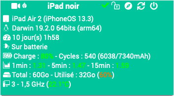

Présentation Jailbreak
==================

Ce plugin permet de récupérer les informations et commander les équipements Apple jailbreakés.

> **Note**  
> Pour fonctionner, il faut installer le tweak OpenSSH sur l'appareil.

**Fonctionnalités**
---------------------
- Éteindre / redémarrer,
- affichage les informations de l'appareil, (*Modèle, version, système d'exploitation, uptime, état batterie, charge système, espace total/utilisé, processeur et température*)
- déverrouiller l'appareil,
- envoyer une notification,
- lancer des applications à distance,
- lancer des raccourcis à distance,
- filmer et envoyer le flux caméra en RTSP.

**Modèles compatibles**
-----------------------
- iPad / iPhone (non testé sur AppleTV/iWatch...)

Dashboard
=========

Configuration du plugin
=======================

Après téléchargement du plugin, activer le plugin.

Configuration des équipements
=============================

La configuration des équipements est accessible à partir du menu *Plugins > Monitoring > Jailbreak*.

Onglet Equipement:
------------------

-   **Nom de l'équipement** : nom de votre équipement,
-   **Objet parent** : indique l’objet parent auquel appartient l’équipement,
-   **Catégorie** : les catégories de l’équipement (il peut appartenir à plusieurs catégories),
-   **Activer** : permet de rendre votre équipement actif,
-   **Visible** : rend votre équipement visible sur le dashboard,
-   **Adresse IP** : adresse IP de l'équipement,
-   **Port SSH** : port SSH de l'équipement (installer OpenSSH sur l'équipement),
-   **Identifiant** : identifiant SSH de l'équipement (par défaut : root),
-   **Mot de passe** : mot de passe associé à l'identifiant SSH de l'équipement (par défaut : alpine).

Onglet Commandes
----------------

Les commandes sont générées automatiquement.

Page Santé
----------

La page Santé est accessible depuis la page de configuration des équipements.
Elle remonte les informations des équipement.

Page Installation
------------------

La page Installation est accessible depuis la page de configuration des équipements.
Elle permet d'envoyer le fichier d'installation des dépendances des équipements.
C'est-à-dire les Tweaks et paquets dont le plugin a besoin, mais aussi les scripts servant à la commande perso.

Script commande perso
=====================

La commande perso permet de créer soi-même une commande personnalisée.

Activator (compatible iOS 11/12/13-test)
---------------------------------------

(si votre appareil est verrouillé, pensez à lancer la commande de déverrouillage avant celle-ci)
* Soit en tapant directement la commande complète : *activator send abracadabra*
* Soit en utilisant le script transféré précédemment depuis la page Installation : *bash jailed/activator_send.sh* *<parametre>*  
Voici la liste des paramètres :  
	low-power|power *(bascule le mode d'économie d'énergie)*,  
	homebutton|home *(appuie sur le bouton home)*,  
	respring *(lance un respring)*,  
	sleep|veille *(appuie sur le bouton verrouillage)*,  
	location *(bascule la localisation)*,  
	rotation *(bascule le verrouillage de rotation d'écran)*,  
	airplane-mode|airplane|avion *(bascule le mode avion)*.  
Appuyez sur le bouton Safari du Dashboard (3 sur la photo ci-dessous)  

Créer ses notifications personnalisées (*Activator*)
----------------------------------------------------
- Sur l'appareil, ouvrir l'app **Activator**,
	sélectionner "Partout",  
	puis l'assigner à un évènement, (peut être réassigné une fois créé),  
	cliquer sur "Build",  
	puis "Show message alert",  
	entrer votre "Titre" et "Message personalisé" et "Enregistrer" puis "OK".  
- Il faut maintenant identifier le message créé pour récupérer son ID.  
	(méthode 1) Se connecter en SSH à l'appareil et entrer dans l'invite de commande *activator listeners | grep message.show*.  
	Si un seul message, récupérer son ID. Si plusieurs messages enregistrés : *activator get LAMessageListeners*  
	(méthode 2) Activer les logs Debug du plugin Jailbreak dans Jeedom.  
	Saisir ce code dans le champ commande perso sur l'équipement *activator get LAMessageListeners*,  
	Sauvegarder, et Tester.  
	Dans les log générés, récupérer l'ID du/des messages à la fin de la ligne : *[2020-01-01 12:00:00][DEBUG] : Sortie action perso :*  
	Récupérer la chaine ID qui suit "...message.show.XXX"  

(si votre appareil est verrouillé, pensez à lancer la commande de déverrouillage avant celle-ci (commande *unlock*))
- Mettre dans le champ commande perso : *activator send libactivator.message.show.XXX* en remplaçant XXX par l'ID récupéré.

Prendre une photo (*Activator*)
-------------------------------
(si votre appareil est verrouillé, pensez à lancer la commande de déverrouillage avant celle-ci (commande *unlock*))
- Mettre dans le champ commande perso : *activator send libactivator.shortcut:com.apple.camera:"Prendre une photo" && sleep 3 && activator send libactivator.volume.down.press*  
	Celle-ci sera enregistrée dans la galerie de l'appareil.

Ouvrir une page d'accueil personnalisée (*Activator*)
-----------------------------------------------------
Peut être utilisé depuis un déclenchement programmé ou provoqué sur Jeedom.  
*Exemple : ouvrir le Dashboard de Jeedom à l'ouverture de la porte d'entrée,  
	ouvrir une page design de Jeedom tous les jours de la semaine à l'heure de partir au travail...*  
- Sur l'appareil, ouvrir Safari et aller sur la page désirée (Dashboard/Design de Jeedom...),  
	cliquer sur le bouton partager, puis "Sur l'écran d'accueil", enfin "Ajouter",  
- Appuyez sur le bouton Safari du Dashboard (3 sur la photo ci-dessous)  

Utiliser votre appareil comme caméra de surveillance (*Activator*/*SimulateTouch*)
----------------------------------------------------------------------------------
Utilisez votre appareil comme caméra de surveillance.  
Nécessite une Application de l'App Store (Periscope HD ou XXX).  
Nécessite un lecteur de flux RTSP (Synology, VLC...)  
	(Periscode HD) - Filme dès l'ouverture de l'application.  
	(IP Camera Lite) - Cliquer sur "Turn on IP Camera Server" pour filmer. *stouch touch 10 500*

Raccourcis (iOS12/13)
---------------------
1) Sur l'application **Raccourcis**, récupérer le nom du raccourci créé/téléchargé.  
2) Sur Jeedom, dans la commande perso, entrer *uiopen "shortcuts://run-shortcut?name=XXX"* en remplaçant XXX par le nom du raccourci.  
(si votre appareil est verrouillé, pensez à lancer la commande de déverrouillage avant celle-ci (commande *unlock*))
    
Liste des versions
==================

*[Voir la liste des versions](changelog.md)*
