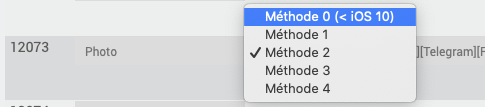
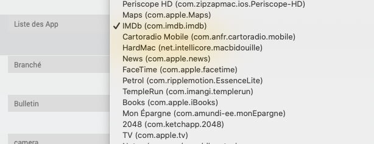

Présentation
============

Ce plugin permet de récupérer les informations et commander les équipements Apple jailbreakés.

> **Note**  
> Pour fonctionner, il faut installer le tweak OpenSSH sur l'appareil.

**Fonctionnalités**
---------------------
  * **Information :**
    * Modèle, version, système d'exploitation, uptime, état batterie, charge système, espace total/utilisé, processeur et température, luminosité, coordonnées GPS...
    * tester les tweaks, voir les processus actifs,
    * lister les voix disponbiles,
    * lister toutes les App disponbiles,

  * **Action :**
    * Éteindre / redémarrer,
    * verrouiller / déverrouiller l'appareil,
    * envoyer des notifications ou des bulletins,
    * executer des raccourcis à distance,
    * lancer n'importe quelle application à distance,
    * utiliser son appareil en tant que caméra de surveillance,
    * prendre une photo et l'envoyer par Telegram/Mail,
    * TextToSpeech via Siri,
    * envoyer des SMS,
    * créer des cron sur l'appareil et les gérer.

**Modèles compatibles**
-----------------------
- iPad / iPhone (non testé sur AppleTV/iWatch...)
- iOS mini testé : 9.3.5
- iOS maxi testé : 13.5

Dashboard
=========


Configuration du plugin
=======================

Après téléchargement du plugin, activer le plugin.

Configuration des équipements
=============================

Afin d'intéragir entièrement avec le plugin Jailbreak, les équipements ont besoin que certains paquets/outils définis soient installés.
Voici la liste de ces paquets :
- apt : *gestionnaire de paquet qui permet d'installer tout le reste*
- curl, wget : *permet de télécharger des ressources*
- adv-cmds, coreutils, gawk, grep, sed : *utile pour trier/selectionner des résultats*
- git : *inutilisé pour l'instant, mais peut être utilisé pour mettre à jour des commandes*
- system-cmds, top, uikittools : *commandes système de l'état de l'appareil*
- unrar, unzip : *désarchiver*
- sshlock : *pour verrouiller l'équipement*
- open : *pour ouvrir une app/page*
- activator, activatorfix : *permet d'ouvrir/lancer/afficher des pages/app/evenement*
- systeminfo : *récupère des informations sur l'équipement*
- say  : *permet se se servir du mode Text To Speech*
- batterydata : *récupère totes les informations sur la batterie*
- lightsensor : *récupère la valeur lde luminosité*
- sensors : *récupère les tensions/ampérageµ/température de tous les capteurs*
- smsme : *permet d'envoyer des SMS depusi les iPhone uniquement*
- gpsloc : *récupère les coordonnées GPS de l'équipement*
  
Ces paquets doivent être installés pour profiter pleinement du plugin Jailbreak.
Un script lancé depuis le menu *Installation* du plugin permet d'installer ces paquets et de les maintenir à jour (voir ci-dessous).

Installation des dépendances des équipements
============================================

Dans le menu *Installation* du plugin, sur l'appareil désiré, envoyer les dépendances et lancer-les.

Commande des équipements
=============================

Les différentes commandes des équipements sont accessibles à partir du menu *Plugins > Monitoring > Jailbreak*.

Onglet Equipement:
------------------

-   **Nom de l'équipement** : nom de votre équipement,
-   **Objet parent** : indique l’objet parent auquel appartient l’équipement,
-   **Catégorie** : les catégories de l’équipement (il peut appartenir à plusieurs catégories),
-   **Activer** : permet de rendre votre équipement actif,
-   **Visible** : rend votre équipement visible sur le dashboard,
-   **Adresse IP** : adresse IP de l'équipement,
-   **Port SSH** : port SSH de l'équipement (installer OpenSSH sur l'équipement),
-   **Identifiant** : identifiant SSH de l'équipement (par défaut : root),
-   **Mot de passe** : mot de passe associé à l'identifiant SSH de l'équipement (par défaut : alpine).

Onglet Commandes
----------------

Les commandes de base sont générées automatiquement.  
L'interval de rafraîchissement des informations est de 5 minutes.  
Excepté les informations figées de l'appareil (modèle, version, OS...) dont l'interval est de 1 jour.  
Il est possbile d'ajouter manuellement des commandes perso.  

Page Santé
----------


La page Santé est accessible depuis la page de configuration des équipements.  
Elle remonte les informations des équipement.

Page Installation
------------------


La page Installation est accessible depuis la page de configuration des équipements.  
Elle permet d'envoyer le fichier d'installation des dépendances des équipements.  
C'est-à-dire les Tweaks et paquets dont le plugin a besoin, mais aussi les scripts servant à la commande perso.  


Le tab Test/Compatibilié dans la page Installation permet :  
- de tester la connexion SSH, vérifier la présence des Tweaks installés précédemment,  
- de lister les arguments possible pour Activator (script perso),  
- et d'afficher les processus actifs (debug).  

Script commande perso
=====================


La commande perso permet de créer soi-même une commande personnalisée.  

Activator (compatible iOS 9/10/11/12/13-test)
---------------------------------------------

*[Si votre appareil est verrouillé, pensez à lancer la commande de déverrouillage avant celle-ci, commande unlock](#tocAnchor-1-13-13)*  

* Soit en tapant directement la commande complète : *activator send abracadabra*
* Soit en utilisant le script transféré précédemment depuis la page Installation : ```bash jailed/activator_send.sh <paramètre> <répétition>```  
Voici la liste des paramètres :  
    * low-power|power *(bascule le mode d'économie d'énergie)*,  
    * homebutton|home *(appuie sur le bouton home)*,  
    * respring *(lance un respring)*,  
    * sleep|veille *(appuie sur le bouton verrouillage)*,  
    * location *(bascule la localisation)*,  
    * rotation *(bascule le verrouillage de rotation d'écran)*,  
    * airplane-mode|airplane|avion *(bascule le mode avion)*,  
    * moinsfort|volumemoins *(baisse le son)*,  
    * plusfort|volumeplus *(augmente le son)*,  
    * screenshot *(prend un imprim'ecran)*,  
    * souriez|photo *(prend une photo avec le dernier objectif utilisé : executer 2 fois si hors de l'App photo)*,  
    * pluslumiere *(augmente la luminosité)*,  
    * moinslumiere *(baisse la luminosité)*,  
    * audio N *(avec N entre 0 et 100 => fixe une valeur au volume)*,  
    * lumière N *(avec N entre 0 et 100 => fixe une valeur à la luminosité)*,  
    * autolock|verrou *(activer/désactiver le verrouillage automatique)*,  
    * darkmode|modesombre *(activer/désactiver le mode sombre)*.  

*Répétition* permet de répéter N fois la commande demandée.  
Ex : *bash jailed/activator_send.sh pluslumiere 5* => répète 5 fois la commande *pluslumiere*  

Appuyez sur le bouton Safari du Dashboard (3 sur la photo ci-dessous)  


Créer ses notifications personnalisées (*Activator*)
----------------------------------------------------
- Sur l'appareil, ouvrir l'app **Activator**,
	sélectionner "Partout",  
	puis l'assigner à un évènement, (peut être réassigné une fois créé),  
	cliquer sur "Build",  
	puis "Show message alert",  
	entrer votre "Titre" et "Message personalisé" et "Enregistrer" puis "OK".  
- Il faut maintenant identifier le message créé pour récupérer son ID.  
    - Méthode 1 : Se connecter en SSH à l'appareil et entrer dans l'invite de commande ```activator listeners | grep message.show```.  
      Si un seul message, récupérer son ID. Si plusieurs messages enregistrés : ```activator get LAMessageListeners```  

    - Méthode 2 : Activer les logs Debug du plugin Jailbreak dans Jeedom.  
      Saisir ce code dans le champ commande perso sur l'équipement ```activator get LAMessageListeners```,  
      Sauvegarder, et Tester.  
      Dans les log générés, récupérer l'ID du/des messages à la fin de la ligne : ```[2020-01-01 12:00:00][DEBUG] : Sortie action perso :```
      Récupérer la chaine ID qui suit ```...message.show.XXX```  

*[Si votre appareil est verrouillé, pensez à lancer la commande de déverrouillage avant celle-ci, commande unlock](#tocAnchor-1-13-13)*  

- Mettre dans le champ commande perso : ```activator send libactivator.message.show.XXX``` en remplaçant XXX par l'ID récupéré.

Prendre une photo (*Activator*)
-------------------------------
*[Si votre appareil est verrouillé, pensez à lancer la commande de déverrouillage avant celle-ci, commande unlock](#tocAnchor-1-13-13)*  

Depuis la commande perso Camera :
Selectionnez la méthode désirée :  
  * 0 : uniquement pour iOS < 10 (utilise le tweak camshot)
  * 1 : ouvre *libactivator.camera.invoke-shutter*
  * 2 : ouvre *libactivator.shortcut:com.apple.camera:Prendre une photo*
  * 3 : ouvre *uiopen "camera://"*
  * 4 : ouvre *com.apple.camera*
  * 5 : ouvre *libactivator.shortcut:com.apple.camera:Enregistrer un ralenti*
  
  

Recherchez la commande Telegram ou Mail pour l'envoi de la photo.
Et cochez le type de commande selectionné.


Ouvrir une page d'accueil personnalisée (*Activator*)
-----------------------------------------------------
Peut être utilisé depuis un déclenchement programmé ou provoqué sur Jeedom.  
*Exemple : ouvrir le Dashboard de Jeedom à l'ouverture de la porte d'entrée,  
	ouvrir une page design de Jeedom tous les jours de la semaine à l'heure de partir au travail...*  
- Sur l'appareil, ouvrir Safari et aller sur la page désirée (Dashboard/Design de Jeedom...),  
	cliquer sur le bouton partager, puis "Sur l'écran d'accueil", enfin "Ajouter",  
- Appuyez sur le bouton Safari du Dashboard (3 sur la photo ci-dessous)  


Utiliser votre appareil comme caméra de surveillance (*Activator*/*SimulateTouch*)
----------------------------------------------------------------------------------
Utilisez votre appareil comme caméra de surveillance.  
Nécessite une Application de l'App Store (Periscope HD ou IP Camera Lite ou LiveReporter ou Karakuri Camera).  
Nécessite un lecteur de flux RTSP ou Snapshot JPG (Plugin Camera, Synology, VLC...)  
  * (Periscode HD) - Filme dès l'ouverture de l'application. (envoi un flux RTSP)  
  * (IP Camera Lite) - Une fois l'app ouverte, cliquer sur "Turn on IP Camera Server" pour filmer. ```stouch touch 10 500``` (envoi un flux RTSP)  
  * (LiveReporter) - Filme dès l'ouverture de l'application. (envoi un flux RTSP)  
  * (Karakuri Camera) - Filme dès l'ouverture et présente une image jpg à l'adresse : http://@IP/preview.jpg à chaque GET http://@IP/preview.json
    - compatible avec le plugin Camera qui permet ces actions :  
      - activer la caméra frontale,  
      - activer la caméra dorsale,  
      - activer/désactiver l’affichage vidéo sur l’appareil (écran noir),  
      - activer/désactiver le son,  
      - régler les fps des snapshot,  
      - régler le niveau audio,  
      - régler la qualité d’encodage jpeg,  
      - régler l’intervalle de temps entre les images,  
    - et qui permet de récupérer ces informations :  
      - Date heure,  
      - dimension des jpeg,  
      - pourcentage de différence entre les jpg,  
      - mémoire utilisée,  
      - batterie restante.  


Raccourcis (iOS 12/13)
---------------------
1) Sur l'application **Raccourcis**, récupérer le nom du raccourci créé/téléchargé.  
2) Sur Jeedom, dans la commande perso, entrer ```uiopen "shortcuts://run-shortcut?name=XXX"``` en remplaçant XXX par le nom du raccourci.  
*[Si votre appareil est verrouillé, pensez à lancer la commande de déverrouillage avant celle-ci, commande unlock](#tocAnchor-1-13-13)*  

Text To Speech (iOS 9/10/11/12/13)
-------------------------
Faites parler Thomas, Amelie ou n'importe quel voix en envoyant un message texte.  
Depuis le dashboard, saisissez le texte que vous souhaitez faire lire à votre appareil (limite de 5 secondes de lecture).  
Depuis Jeedom (scenario, script, autre plugin...), vous pouvez utiliser l'action message pour faire parler votre appareil.  


Plus d'info sur la commande : [GitHub Say](https://github.com/Flobul/Say)

SMS (9/10/11/12/13)
-------------------
Envoyez un SMS depuis votre iPhone uniquement via Jeedom.  
Prérequis : avoir un iPhone (iPad, AppleWatch non fonctionnels), avoir une carte SIM active sur l'iPhone.  


Plus d'info sur la commande : [GitHub SMSme](https://github.com/Flobul/SMSme)

GPS (9/10/11/12/13)
-------------------
Récupérer les coordonnées GPS de l'appareil grâce à l'outil gpsloc.  
Autorisez la localisation pour l'App "Localiser mon iPhone" sur votre appareil.  

Plus d'info sur la commande : [GitHub GPSLoc](https://github.com/Flobul/GPSLoc)

Notification et Bulletin (9/10/11/12/13) (à vérifier)
-------------------
Envoyer une notification personnalisée ou un bulletin sur son appareil.  

Sur Jeedom :  
  

Notification sur l'appareil :  


Bulletin sur l'appareil :  


Plus d'info sur la commande : [GitHub Publication](https://github.com/Flobul/PublicationMe)
Plus d'info sur la commande : [GitHub Bulletin](https://github.com/Flobul/NotifyMe)

Liste des App
-------------------
Cette commande affiche dans un menu déroulant la liste actuelle des applications installées sur l'appareil.  
On peut alors la selectionner puis enregistrer l'équipement, afin de pouvoir executer la commande de lancement de cette App.  



Gestion du cron commandes
-------------------
Ce cron permet de créer un cron directement sur l'appareil.  
Et d'envoyer des informations listées selon des intervalles définis.  

Attention aux intervalles rapprochés qui risquent de consommer la batterie de votre appareil.  


Sélectionnez une ou plusieurs commandes dans la liste, choisissez l'intervalle de temps et cliquez sur créer.  
Le cron va être créé sur l'appareil et être executer. En rechargeant la page, son statut va passer à OK.  
- Vous pouvez alors le stopper : cliquez sur le carré blanc sur fond rouge stop son execution, il suffit de cliquer sur le triangle blanc sur fond vert pour le relancer (inutile de le recréer à zero),  
- récupérer les log : cliquez sur le bouton Log va télécharger les log et les présenter dans la page Configuration du plugin (\_cron à la fin du nom),  
- laissez Jeedom gérer la gestion automatique : si vous activer la fonction, le plugin Jailbreak va vérifier chaque jour que le cron est executer et le lancer dans le cas contraire.  

ASTUCE pour executer la commande déverrouillage avant une commande
------------------------------------------------------------------
Dans les réglages de la commande que l'on veut lancer (ouvrir Safari, ouvrir une app), ajoutez une *action avant d'execution la commande*, et cherchez la commande de deverrouillage (unlock) puis sauvegardez.  


 

 
